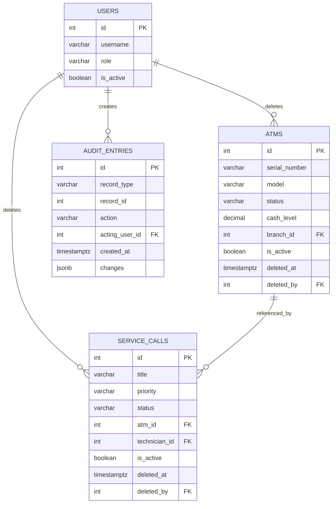

# CashCow ERD — Soft Delete and Audit Trail

```mermaid
erDiagram
    USERS {
        int id PK
        varchar username
        varchar role
        boolean is_active
    }

    ATMS {
        int id PK
        varchar serial_number
        varchar model
        varchar status
        decimal cash_level
        int branch_id FK
        boolean is_active
        timestamptz deleted_at
        int deleted_by FK
    }

    SERVICE_CALLS {
        int id PK
        varchar title
        varchar priority
        varchar status
        int atm_id FK
        int technician_id FK
        boolean is_active
        timestamptz deleted_at
        int deleted_by FK
    }

    AUDIT_ENTRIES {
        int id PK
        varchar record_type
        int record_id
        varchar action
        int acting_user_id FK
        timestamptz created_at
        jsonb changes
    }

    USERS ||--o{ AUDIT_ENTRIES : creates
    USERS ||--o{ ATMS : deletes
    USERS ||--o{ SERVICE_CALLS : deletes
    ATMS ||--o{ SERVICE_CALLS : referenced_by
```
